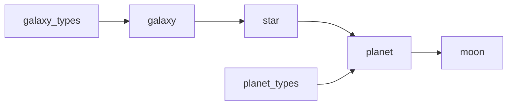

# Celestial Bodies Database

A relational PostgreSQL database that models the universe — galaxies, stars, planets, and moons — built as part of freeCodeCamp's [Relational Database](https://www.freecodecamp.org/learn/relational-database/) curriculum.

## 📖 Overview

This project explores relational database design by mapping real astronomical data into a normalized schema. It captures how celestial bodies relate to one another: galaxies contain stars, stars host planets, and planets have moons.

## 🗂️ Schema

The database consists of **6 tables**:

| Table | Description |
|---|---|
| `galaxy` | Galaxies, with age, distance from Earth, and a linked galaxy type |
| `galaxy_types` | Lookup table for galaxy classifications (Spiral, Elliptical, Irregular, etc.) |
| `star` | Stars, each belonging to a galaxy |
| `planet` | Planets, each orbiting a star and belonging to a galaxy, with a linked planet type |
| `planet_types` | Lookup table for planet classifications (Terrestrial, Gas Giant, Ice Giant, Dwarf) |
| `moon` | Moons, each orbiting a planet |

### Relationships



- Each **star** references a **galaxy**
- Each **planet** references a **star**, a **galaxy**, and a **planet type**
- Each **moon** references a **planet** (and its galaxy)

### Data types used

- `SERIAL` / auto-incrementing `INT` primary keys
- `VARCHAR` for all `name` columns
- `NUMERIC` for precise measurements (age in millions of years, distance from Earth)
- `INT` for whole-number measurements (distance in light-years, radius in km)
- `TEXT` for longer descriptions
- `BOOLEAN` for flags like `is_spherical` and `has_life`

## 🛠️ Tech Stack

- **PostgreSQL**

## 🚀 Getting Started

Rebuild the database locally from the SQL dump:

```bash
psql -U postgres < universe.sql
```

Then connect and explore:

```bash
psql --username=freecodecamp --dbname=universe
```

```sql
\dt                      -- list all tables
\d galaxy                -- describe the galaxy table
SELECT * FROM galaxy;    -- view galaxy data
```

## 📊 Sample Queries

```sql
-- All planets in the Milky Way
SELECT p.name, p.radius_in_km
FROM planet p
JOIN galaxy g ON p.galaxy_id = g.galaxy_id
WHERE g.name = 'Milky Way';

-- All moons of a given planet
SELECT m.name
FROM moon m
JOIN planet p ON m.planet_id = p.planet_id
WHERE p.name = 'Jupiter';

-- Galaxies ordered by distance from Earth
SELECT name, distance_from_earth_ly
FROM galaxy
ORDER BY distance_from_earth_ly ASC;
```

## 📚 Data Sources

Astronomical data (distances, ages) referenced from NASA, Wikipedia, and other publicly available astronomy resources.

## ✅ Project Requirements

This project fulfills the freeCodeCamp requirements for the Celestial Bodies Database, including:
- Normalized schema with foreign keys and lookup tables
- Auto-incrementing primary keys following `table_name_id` convention
- Enforced `NOT NULL` and `UNIQUE` constraints
- A mix of `INT`, `NUMERIC`, `TEXT`, `BOOLEAN`, and `VARCHAR` data types

## 📄 License

This project is open source and available for educational purposes.